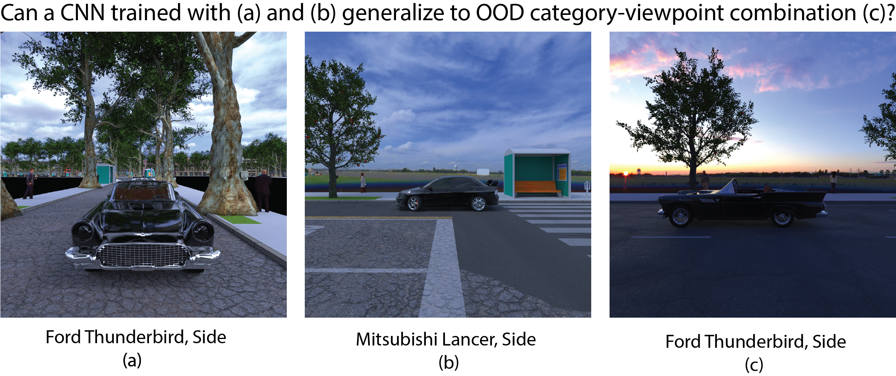

<h3>When and How CNNs generalize to out-of-distribution category-viewpoint combinations.</h3>
  
  <!-- <a href="#about">About</a> • -->
  <!-- <a href="#crtnet-model">CRTNet Model</a> • -->
  <!-- <a href="#code-architecture">Code Architecture</a> • -->
  <a href="#datasets">Datasets</a> •
  <!-- <a href="#mturk-experiments">Mturk Experiments</a> • -->
  <a href="#citation">Citation</a> •
  <!-- <a href="#notes">Notes</a> • -->
  <!-- <a href="#license">License</a> -->

This repository contains the official implementation of our paper published in Nature Machine Intelligence: *When and how convolutional neural networks generalize to out-of-distribution category and viewpoint combinations*. Here you can find the code, and the newly introduced Biased-Cars dataset.

The paper can be accessed [here](https://arxiv.org/abs/2007.08032).

<h3>Authors</h3>
  <!--  -->
  <a href="#about">Spandan Madan</a> •
  <a href="#about">Timothy Henry</a> •
  <a href="#about">Jamell Dozier</a> •
  <a href="#about">Helen Ho</a> •
  <a href="#about">Nishchal Bhandari</a> •
  <a href="#about">Tomotake Sasaki</a> •
  <a href="#about">Frédo Durand</a> •
  <a href="#about">Hanspeter Pfister</a> •
  <a href="#about">Xavier Boix</a>

# Project Overview
Recent works suggest that convolutional neural networks (CNNs) fail to generalize to out-of-distribution (OOD) category-viewpoint combinations, ie. combinations not seen during training. In this paper, we investigate when and how such OOD generalization may be possible, and identifying the neural mechanisms that facilitate such OOD generalization.

We show that increasing the number of in-distribution combinations (ie. data diversity) substantially improves generalization to OOD combinations, even with the same amount of training data. We compare learning category and viewpoint in separate and shared network architectures, and observe starkly different trends on in-distribution and OOD combinations, ie. while shared networks are helpful in-distribution, separate networks significantly outperform shared ones at OOD combinations. Finally, we demonstrate that such OOD generalization is facilitated by the neural mechanism of specialization, ie. the emergence of two types of neurons -- neurons selective to category and invariant to viewpoint, and vice versa.

# Datasets

## Biased-Cars Dataset

We introduce a challenging, photo-realistic dataset for analyzing out-of-distribution performance in computer vision: the Biased-Cars dataset. Our dataset offers complete control over the joint distribution of categories, viewpoints, and other scene parameters, and the use of physically based rendering ensures photo-realism. Some features of our dataset:

- Photorealism with diversity: Outdoor scenes with fine control over scene clutter (trees, street furniture, and pedestrians), car colors, object occlusions, diverse backgrounds (building/road textures) and lighting conditions (sky maps).

- Fine grained control: 30K images of five different car models with different car colors seen from different viewpoints car colors varying between 0-90 degrees of azimuth, and 0-50 degrees of zenith across multiple scales.

- Labels for several computer vision tasks: We provide labels for car model, color, viewpoint and scale. We also provide semantic label maps for background categories including road, sky, pavement, pedestrians, trees and buildings.

Our dataset can be downloaded[here](https://dataverse.harvard.edu/dataset.xhtml?persistentId=doi:10.7910/DVN/F1NQ3R).

For ease, an example showing loading and training with the Biased-Cars dataset has been provided under tutorials.

## Previously published datasets used in our analysis
- iLab Dataset: http://ilab.usc.edu/ilab2m/iLab-2M.tar.gz
- MNIST-Rotation: https://www.dropbox.com/s/wdws3b3fjo190sk/self_generated.tar.gz?dl=0
- UIUC 3D Dataset: http://www.eecs.umich.edu/vision/data/3Ddataset.zip

## Citation

@misc{madan2021cnns,
      title={When and how CNNs generalize to out-of-distribution category-viewpoint combinations},
      author={Spandan Madan and Timothy Henry and Jamell Dozier and Helen Ho and Nishchal Bhandari and Tomotake Sasaki and Frédo Durand and Hanspeter Pfister and Xavier Boix},
      year={2021},
      eprint={2007.08032},
      archivePrefix={arXiv},
      primaryClass={cs.CV}
}
